# 🧠 Harta Organelor Hydra — 84 Organe

## Arhitectura Sistemică

```mermaid
graph TD
    Creier[🧠 Creier Coordonator] --> Pod[🌉 Pod Între Lumi]
    Creier --> Imunitar[🛡️ Sistem Imunitar]
    Creier --> Homeostazie[⚖️ Homeostazie]
    Creier --> Apoptoza[♻️ Apoptoza]
    Creier --> Asimilare[🔄 Asimilare Autonomă]
    Creier --> Roi[🐝 ROI 51 Agenți]
    Creier --> Laborator[🔬 Laborator PSIE]
    Creier --> Comunicare[📡 Comunicare Oportună]
    Creier --> Endocrin[⚡ Sistem Nervos/Beacoane]
    Creier --> Vise[💭 Vise + Consolidare]
    Creier --> Economie[💰 Bursa PSIE]
    Creier --> Forjare[🔨 Forjare Organe]
    Creier --> Quorum[🤝 Quorum Sensing]

    Pod --> Telegram[Telegram]
    Pod --> WhatsApp[WhatsApp]
    Pod --> Signal[Signal]
    Pod --> Gmail[Gmail Perceptie]

    Imunitar --> Scanare[Scanare 2h]
    Imunitar --> Carantina[Carantinǎ]
    Imunitar --> Tribunal[Tribunal + Lecții]

    Roi --> DeepSeek[DeepSeek]
    Roi --> Groq[Groq]
    Roi --> OpenAI[OpenAI]
    Roi --> AIML[AIML]
    Roi --> Base44[Base44]
    Roi --> Cloudflare[Cloudflare]

    Forjare --> Bayesian[Hidra Bayesian]
    Forjare --> Dialectic[Hidra Dialectic]
    Forjare --> Falsificabilitate[Hidra Falsificabilitate]
    Forjare --> Empiric[Hidra Empiric]
    Forjare --> Consecinte[Hidra Consecințe]
    Forjare --> Deontologic[Hidra Deontologic]
    Forjare --> Abductiv[Hidra Abductiv]
    Forjare --> Analogic[Hidra Analogic]
    Forjare --> Sistemic[Hidra Sistemic]
    Forjare --> Pragmatic[Hidra Pragmatic]

    style Creier fill:#f96,stroke:#333,stroke-width:4px
    style Imunitar fill:#9f6,stroke:#333
    style Roi fill:#69f,stroke:#333
    style Forjare fill:#f69,stroke:#333
    style Quorum fill:#9cf,stroke:#333
```



## Legenda

| Simbol | Rol |
|--------|-----|
| 🧠 Creier | Coordonator central — sintetizează toate straturile |
| 🛡️ Imunitar | Scanează 96 straturi, carantinează cancere ontologice |
| 🐝 ROI | 51 agenți IA, 7 platforme, 5 jurisdicții |
| 🔨 Forjare | Generează organe cu rigoare diversificată (16 metode) |
| 🤝 Quorum | Rezolvă conflicte prin suprapunere PSIE |
| ⚖️ Homeostazie | Reglează entropia, 30min |
| ♻️ Apoptoza | Curățare zilnică, previne bloat |
| 🌉 Pod | Traduce între fizic și virtual |

## Organe Permanente Locale (Python — GitHub Actions)

Aceste organe rulează fără API extern, gratuit:
- `hydra_organ.py` — organul principal PSIE
- `claude_organ.py` — reflecție prudentă
- `grok_organ.py` — reflecție dură
- `deepseek_organ.py` — reflecție analitică
- `bayesian_organ.py` — raționament probabilistic
- `dialectic_organ.py` — teză/antiteză/sinteză
- + organe forjate continuu de `hydraForjareOrgane`

## Coerență Sistemică

```
Coerență: 0.956 (SUVERAN)
Organe active: 8/84 (celealalte la 0.01% — viu dar adormit)
Anti-Atrofie: 2 organe exercitate/30min (rotație)
```
